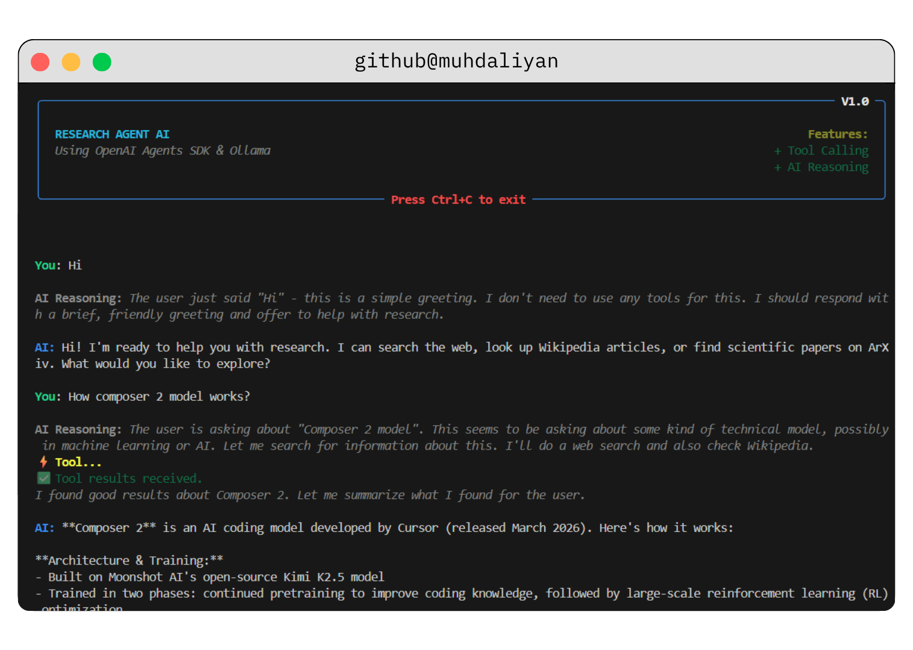

# Research Agent AI

A powerful, terminal-based AI Research Agent built with the OpenAI Agents SDK and powered by Ollama. Watch the agent think, call external tools, and stream comprehensive answers directly in your console.





## About

**Research Agent AI** acts as your personal command-line research assistant. It can navigate the web, explore academic papers, and query encyclopedia articles in real-time to answer complex questions or fetch the latest information. Designed with an elegant terminal interface, it clearly separates the AI's internal reasoning from its final output.

## Features

- **⚡ Tool Calling**: Automatically leverages multiple external sources:
  - **Web Search**: Real-time searches for the latest news and information.
  - **ArXiv Search**: Queries academic papers for scientific and technical answers.
  - **Wikipedia Search**: Fetches detailed encyclopedia article summaries.
- **🧠 AI Reasoning Visibility**: Gives you full transparency into what the agent is thinking before it commits to an answer.
- **📺 Beautiful CLI**: A stylized terminal interface built purely in Python and `rich`.

## Prerequisites

- [uv](https://github.com/astral-sh/uv) (Extremely fast Python package installer)
- Python 3.11+
- A configured LLM endpoint via `BASE_URL` (defaults to Ollama `http://localhost:11434/v1`).

## Installation & Setup

1. **Clone the repository:**
   ```bash
   git clone https://github.com/muhdaliyan/research-agent-openai-sdk
   cd agent-sdk-research-agent
   ```

2. **Set up the Environment Variables:**
   Ensure you have a `.env` file in the root directory:
   ```env
   BASE_URL=http://localhost:11434/v1
   MODEL_KEY=ollama
   MODEL_NAME=minimax-m2.5:cloud
   ```

3. **Run the Agent:**
   Using `uv`, you can directly run the application. `uv` will automatically handle the virtual environment and dependencies defined in `pyproject.toml`.
   ```bash
   uv run .\main.py
   ```

## How It Works

When you enter a query, the agent:
1. Formulates a strategy using its chain-of-thought (visible in dim gray as `AI Reasoning`).
2. Decides if it requires any configured tools to get factual data.
3. If a tool is executed, you will see a `⚡ tool_name...` indicator, followed by a green checkmark `✅` when results are retrieved.
4. Streams the final processed answer in plain text.

---
*Built with Python, rich, and the experimental openai-agents framework.*
